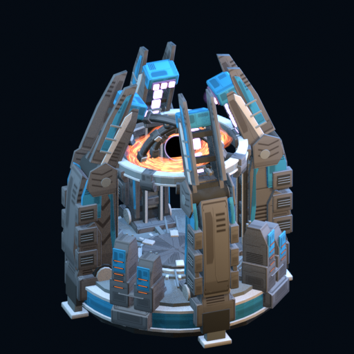

# Singularity

Replaces Ragnarok's appearance with Singularity, a massive black hole generator with rotating containment rings and dramatic effects. Keeps the original gameplay, balance, and audio.

For **Planetary Annihilation: TITANS**, by **krplatz**. Version 0.9.2 — beta.

## Features

- Dense containment structure with nested animated gyroscopes and opening gantries.
- Plasma compression followed by black-hole formation around 24 seconds after activation.
- Warped accretion mesh, inward particles and a controlled core descent.
- Blue PA-style build icon with Titan marker; displayed unit name **Singularity**.
- Stock costs, health, weapon, charge duration, planet destruction and audio cues. No audio files are bundled.

This replaces the existing Ragnarok visually; it does not add a separate buildable unit. The stock charge is 176 seconds, not the shortened comparison-video timing. Other players need this client mod to see its visuals.

## Status

The initial mesh and motion have been viewed in-game. The updated texture packaging, accretion effect and UI name/icon still need broader in-game verification. One test installation loses its local filesystem-mod registration when leaving Community Mods. Publication through the managed download route is being evaluated; it is not a confirmed fix.

All 14 PAPA assets pass the game's format reader and asset references resolve. The unit JSON differs from stock only in its display name. Audio events match stock. These checks do not establish visual correctness or multiplayer compatibility.

## Installation

Community Mods listing is pending submission and review. This GitHub upload alone does not make the mod available in the in-game catalogue.

For manual testing, download this repository and place its contents in a folder named `com.pa.endgame.ragnarok-singularity` under your PA data directory's `client_mods` folder. `modinfo.json` must be directly inside that folder. Enable **Singularity** in Community Mods and fully restart the game to clear cached art. Disable conflicting Ragnarok appearance mods. The strategic-map symbol remains stock.

To remove, disable Singularity and restart. When switching to a managed Community Mods download, move the manual copy out of `client_mods` first to avoid duplicate identifiers.

## Credits

Mod author: **krplatz**. Custom model, animations, textures, effects and icon work were developed with AI-assisted tooling; the blue build icon uses image generation with the model and stock icon as references. The installed Legion Holocene effects informed the layered particle approach; no Legion assets are bundled.

Adapted stock unit/effect data and game references belong to their respective Planetary Annihilation rights holders. Planetary Annihilation: TITANS is required. This project is not an official game release.
